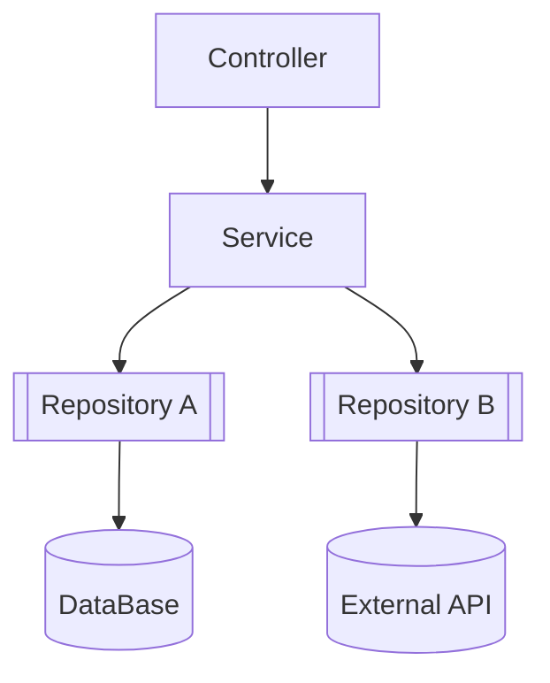

# dotnet-webapi-architecture

## Layered Architecture

```mermaid
graph TD;
    Controller-->Service;
    repoA[[Repository A]];
    repoB[[Repository B]];
    ds1[(DataBase)];
    ds2[(External API)];
    Service-->repoA;
    Service-->repoB;
    repoA-->ds1;
    repoB-->ds2;
```
